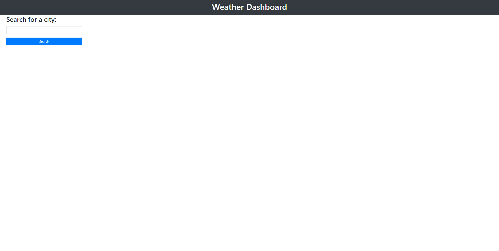
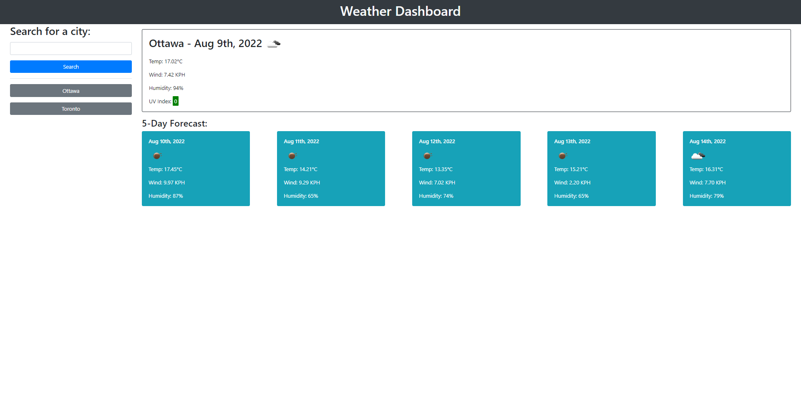

# Weather Forecast Dashborad

## Description
The purpose of this project is to consume a third-party API. Using JavaScript to get data from a remote server using specific parameters to a URL. In this project, the OpenWeather One Call API was used to request for the weather data from a user requested city. The application will first request the Geocoding API for the longitude and latitude for a user requested city. Once those are received from the sever, another API call is made to One Call API 1.0 to get the current weather data for the city. Next Another API call is made to 5 Day / 3 Hour Forecast API to get the 5 day forcast for that city. The application also sotre the top 10 most recent searches made in the local storage of the browser.

## Application Homepage
The following image shows the application homepage when the application is started for the first time

## Application Search Result
the following image shows the applcation when a user has requested the weather data for a city. On the left hand side of the image you can see a list of the most recent searches.

## Deployed Link
The deployed application can be accessed by clicking [here](https://shawnmaz.github.io/weather-forecast/).

---
© 2022 Shantanu Mazumder.